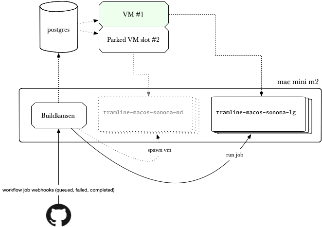

<p align="center">
  <picture>
    <source media="(prefers-color-scheme: dark)" srcset="art/buildkansen.png">
    
  </picture>
</p>

# Buildkansen

Fast, pooled, custom macOS runners for GitHub Actions. Just change a single line in your workflows to get faster and cheaper iOS/macOS builds.


## Structure

Buildkansen is a Go service and a collection of tools that come together to power custom macOS runners: 

1. Single-binary (bin-stuffed) Go service that powers the admin page and the VM orchestration
2. Packer files with pre-configured utilities to run macOS VMs
3. Ansible scripts to deploy the service and prepare the host machine for VM orchestration
4. Bash scripts that manage running and stopping of VMs

### Running locally

```bash
bin/ssl
just css
just web
```

The service will be available at `https://localhost:8081`.

## Design & architecture

<figure>
  
</figure>

Buildkansen uses a GitHub app to authorize your code repositories. It then uses the GitHub API to listen for new jobs and orchestrate the VMs to run them. The VMs are pre-configured with the necessary tools and are pooled to be used by multiple jobs. 

The service is current run directly on the host mac machine which also hosts the VMs.

## Building macOS images

This section relates to [pool/](pool/).

The Xcode xip file is no longer available on the Apple Developer site without authentication, which means that the packer script can't directly download it.

We've hosted it on our [Google Drive](https://drive.usercontent.google.com/download?id=1Xmf1WrxkAThDoQGvxE8Q3_4Jx13i4XHU&export=download&authuser=1&confirm=t&uuid=1d669d53-6e5c-4718-bf6e-ac8f235234d0&at=APZUnTUOFnuG5x973LxfhLqvK60w%3A1706657627430), a link to which can be supplied:

```bash
packer build -var "vm_name=sonoma-runner-md" -var "base_vm=sonoma-base-md" -var "<link to Xcode15.2.xip>" runner.pkr.hcl
```

To build the base image:


```bash
packer build -var "vm_name=sonoma-base-md" sonoma.pkr.hcl
```

### Image nomenclature

The image names are as follows:

- `sonoma-base-md` is the base image that sets up the mac on first boot – SSH, keys etc.
- `sonoma-runner-md` sets up tooling – homebrew, ruby, xcode etc.

It follows `<macOS version>-<purpose>-<size>`

| size | disk  | cpu | memory |
|------|-------|-----|--------|
| md   | 100gb | 4   | 4gb    |
| lg   | 150gb | 6   | 6gb    |

The same scheme is used for the GitHub runner labels as well, for example:

- `tramline-macos-sonoma-md`
- `tramline-macos-sonoma-lg`

## Deployment

This section relates to [deployment/](deployment/).

### Prerequisites

The ansible script to deploy/setup mac machines relies on SSH agent forwarding, ensure you something like this configured in `~/.ssh/config`:

```bash
Host <host>
  ForwardAgent yes
```

And also ensure your SSH key (that has access to the repo) is added to the agent:

```bash
ssh-add -L
ssh-add -K ~/.ssh/id_rsa_github
ssh-add -L
```

### Setting up or updating the mac machines

```bash
ansible-playbook -i hosts.ini -c ssh --ask-pass -K setup_mac.yml
```

## Orchestration scripts

This section relates to [host/](host/).

The only script that needs to be called from the host mac machine is,

```bash
./guest.vm.park -i ghcr.io/tramlinehq/sonoma-runner-md:latest -n sonoma-runner-md -l tramline-macos-sonoma-md
```

There are a couple of other scripts:

```
./guest.vm.up
./guest.vm.down
```

These needn't be called manually as they are run and managed by the service. However, in case you should need to get VMs up and down for development convenience, they are designed to be user-friendly to be called from the CLI as well.
